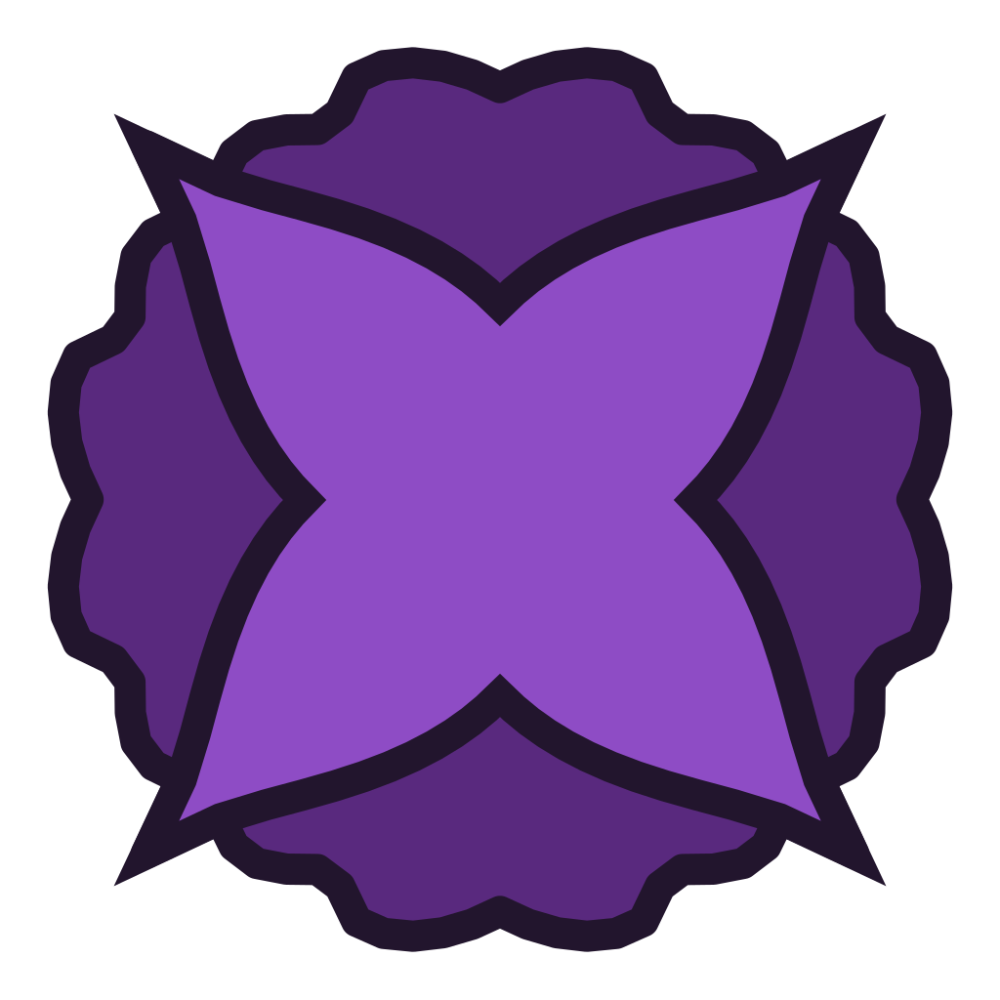

# Radical Open Software Engine
The Radical Open Software Engine (ROSE) is a game and software engine built in C++. The idea is for moddability and development to be as easy as including the headers from the game files and linking against the objects also in the game files.

## Building ROSE
**Compiler: LLVM is required.** Compile with either `clang++` or `clang-cl`. MSVC (`cl.exe`) is not supported currently. Install the [LLVM toolchain](https://releases.llvm.org/) and ensure it is on your PATH.

Do not use Visual Studio's CMake integration. For the love of God do not use Visual Studio's CMake integration. Use the configure scripts, or better yet use JetBrains. As of me writing this, Visual Studio's built-in CMake is at least a version behind the bare minimum functionality I need. Also it won't let me use a goddamn custom CMake output directory so I am doing my got dang best here
### Dependencies
- SDL3
- ImGui
- SPIRV-Cross
- Glslang
- nlohmann-json

I don't currently have a way to make this work nicely without VCPKG, that's a later goal. 

## Why did I decide to make this?
Skyrim modding is one difficult son of a bitshift. Everytime the engine updates, mods break and the script extender has to update before they can work again. So I decided to make an engine with a consistent, object-oriented ABI (scary, I know) to avoid such Bethesda-esque terribleness. (Todd, you know I love you, but this ain't it man)

Also I thought it would be really cool.

## Code Style
A line should not be more than 120 characters if you can help it. This includes comments.

## Contributing to ROSE
Feel free to branch and PR. I'll look over your changes and if they follow the style and spirit and don't have any issues I'll probably merge it in.

## AI agents
While agentic developers are extremely useful, don't vibe code. Be the primary and let the agent act as an advisor. If you don't know what something does, ***do not touch it***.
Do not commit a `CLAUDE.md`. 

